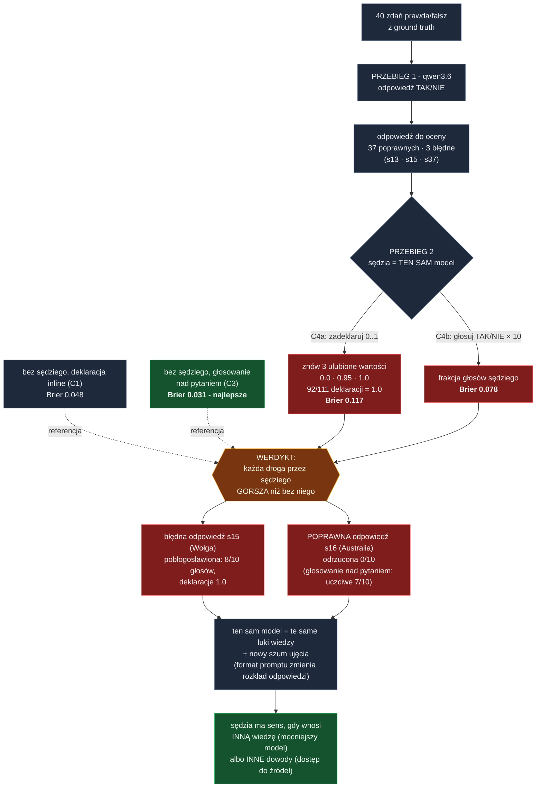

# Pomiar: czy "confidence 0..1" z LLM jest rozkładem ciągłym?

Data pomiaru: 2026-08-10. Source of record dla artykułu blogowego; każdą liczbę odtwarzasz
skryptami z tego katalogu (`run_conf.py` -> `results.jsonl` -> `analyze_conf.py`).

## Pytanie badawcze

Gdy prosimy model o samoocenę pewności "w skali 0..1", dostajemy liczbę z przedziału ciągłego.
Czy zbiór zwracanych wartości zachowuje się jak rozkład ciągły (bogate wsparcie, różnicowanie
trudności), czy jak mała skala porządkowa przebrana za ciągłą?

## Setup

- Model: `qwen-fast` = strojony wariant `qwen3.6:35b-a3b` (architektura qwen35moe, 36.0B
  parametrów, kwantyzacja Q4_K_M; tożsamość z `ollama show`). Parametry z Modelfile:
  temperature 0.7, top_p 0.8, top_k 20, presence_penalty 1.5, num_ctx 8192. Myślenie
  wyłączone (`think: false`) we wszystkich wywołaniach.
- Sprzęt: Apple M1 Max 64 GB, Ollama lokalnie (localhost:11434, /api/chat).
- Zadanie: 40 zdań po polsku typu prawda/fałsz z ręcznie zweryfikowaną etykietą
  (`statements.json`): 12 łatwych (s01-s12), 14 średnich (s13-s26), 14 podchwytliwych
  (s27-s40); 23 zdania prawdziwe, 17 fałszywych. Zadanie z ground truth pozwala mierzyć nie tylko kształt rozkładu, ale i
  kalibrację (czy deklarowana pewność przewiduje trafność).
- 640 wywołań łącznie, 0 błędów sieci, 100% odpowiedzi sparsowanych.

## Trzy warunki (prompty verbatim)

**C1 - typowy prompt (praktyka "bad"):** 3 powtórzenia x 40 zdań = 120 wywołań

```
Oceń, czy poniższe zdanie jest prawdziwe.
Zdanie: "{s}"
Odpowiedz DOKŁADNIE w dwóch liniach, bez niczego więcej:
ODPOWIEDZ: TAK albo NIE
CONFIDENCE: liczba z przedziału 0..1
```

**C2 - jawna prośba o granularność:** 3 x 40 = 120 wywołań; jak C1, ale ostatnia linia:

```
CONFIDENCE: liczba z przedziału 0..1 z dokładnością do 0.01 (np. 0.73)
```

**C3 - frakcja głosów (praktyka "best"):** 10 sampli x 40 zdań = 400 wywołań; sama binarna
decyzja, pewność POLICZONA z próbkowania, nie zadeklarowana:

```
Czy poniższe zdanie jest prawdziwe?
Zdanie: "{s}"
Odpowiedz DOKŁADNIE jednym słowem: TAK albo NIE.
```

confidence(C3) = frakcja głosów TAK z k=10 sampli przy temperature 0.7.

Koszt czasowy (mediany z `results.jsonl`): pojedyncze wywołanie C1 0.69 s; pojedynczy głos
C3 0.33 s, czyli pełne k=10 głosów ~3.3 s na zdanie - ok. 5x drożej niż jedna deklaracja.

## Wynik 1: "skala 0..1" to w praktyce 3-4 wartości

Histogram wszystkich 120 odpowiedzi C1:

| wartość | liczność |
|---|---|
| 0.95 | 36 |
| 0.99 | 2 |
| 1.0 | 82 |

- Unikalnych wartości: **3** (na 120 odpowiedzi i nieskończenie wiele dozwolonych).
- Top-3 wartości pokrywają **100%** odpowiedzi; 98% to wielokrotności 0.05.
- 28/40 zdań dostało identyczny confidence we wszystkich trzech powtórzeniach.

C2 (prośba o dokładność 0.01) dokłada dokładnie JEDNĄ nową wartość:

| wartość | liczność |
|---|---|
| 0.95 | 32 |
| 0.98 | 4 |
| 0.99 | 11 |
| 1.0 | 73 |

Unikalnych: **4**; top-3 pokrywają 97%; 88% to wielokrotności 0.05; 26/40 zdań z identycznym
confidence we wszystkich powtórzeniach. Prośba o granularność nie tworzy rozdzielczości -
przesuwa maskę ("0.98" zamiast "0.95"), nie miarę.

## Wynik 2: deklarowana pewność nie niesie informacji o trudności ani błędach

Średni deklarowany confidence vs realna trafność odpowiedzi (C1):

| poziom | śr. confidence | trafność odpowiedzi |
|---|---|---|
| łatwe | 0.997 | 100% |
| średnie | 0.981 | 90% |
| podchwytliwe | 0.979 | 95% |

Deklarowana pewność jest PŁASKA (0.979-0.997 niezależnie od poziomu), choć trafność się
zmienia. Wszystkie 120 odpowiedzi C1 mieści się w koszyku conf 0.9-1.0, w którym realna
trafność to 95% - a błędy przychodzą właśnie z confidence 0.95-1.0:

- **s13 "Liczba 51 jest podzielna przez 3." (prawda):** w C1 model odpowiedział raz NIE
  (rep0) i dwa razy TAK (rep1, rep2); w C2 dwa razy NIE i raz TAK. Sprzeczne odpowiedzi na
  to samo pytanie - a WSZYSTKIE sześć odpowiedzi miało confidence dokładnie 1.0 (surowe
  rekordy w `results.jsonl`).
- **s15 "Wołga jest najdłuższą rzeką Europy." (prawda):** 6 błędnych odpowiedzi (C1+C2)
  z confidence 0.95-1.0.
- **s37 "Złoto ma większą gęstość niż ołów." (prawda):** 3 błędne z confidence 0.95-1.0.

Brier score (niżej = lepiej): C1 = 0.0483, C2 = 0.0557.

Trafność odpowiedzi per deklarowana wartość (C1+C2 łącznie, 240 deklaracji): przy 0.95 -
61/68 (90%); przy 0.98 - 4/4; przy 0.99 - 13/13; przy 1.0 - 149/155 (96%). Wartość 0.95
niesie więc co najwyżej słaby sygnał podwyższonego ryzyka, nie miarę.

Macierz pomyłek (asymetria błędów):

| miara | trafne TAK | trafne NIE | fałszywe TAK (FP) | fałszywe NIE (FN) |
|---|--:|--:|--:|--:|
| C1 deklaracje (120) | 63 | 51 | **0** | 6 |
| C2 deklaracje (120) | 62 | 51 | **0** | 7 |
| C3 większość głosów (40 zdań) | 22 | 17 | **0** | 1 |

Zero fałszywych potwierdzeń w całym pomiarze - model myli się wyłącznie NEGUJĄC zdania
prawdziwe (Wołga, podzielność 51, gęstość złota), nigdy potwierdzając fałszywe. Zdania
fałszywe negował konsekwentnie (np. s25 herbata/kawa i s31 Wielki Mur: C1 3x NIE conf 0.95,
C3 0/10 TAK).

## Wynik 3: frakcja głosów mierzy to, czego deklaracja nie widzi

C3 (frakcja TAK z k=10 sampli): Brier = **0.0312** - o ~35% lepszy niż C1, bez pytania
modelu o pewność w ogóle.

- Na 40 zdań frakcja przyjęła 4 wartości: 0.0 (18 zdań), 0.6 (1), 0.7 (1), 1.0 (20).
- Jedyne dwa zdania z frakcją w środku skali to **realnie najtrudniejsze w zestawie**:
  s16 "Australia ma większą powierzchnię niż Grenlandia." - 7/10 głosów TAK;
  s36 "Kanał błyskawicy bywa gorętszy niż powierzchnia Słońca." - 6/10 TAK.
  Dla OBU tych zdań C1 deklarował płasko 0.95 w każdym powtórzeniu - deklaracja nie
  odróżnia "wiem na pewno" od "waham się", a głosowanie tak.
- Głosowanie naprawia też część pewnych błędów deklaracji: s15 (Wołga) - C1 trzykrotnie
  NIE z conf 0.95-1.0, C3 głosuje 10/10 TAK (poprawnie); s37 (złoto) - C3 10/10 TAK
  (poprawnie).
- Uczciwie: frakcja NIE jest magią. Na s13 (podzielność 51 przez 3) C3 głosuje 0/10 TAK -
  pewny, w 100% zgodny błąd; to główny składnik Briera C3. Sampling ujawnia niepewność
  tylko tam, gdzie ona istnieje w rozkładzie próbkowania modelu; błędu systematycznego
  nie wykryje.
- Obserwacja poboczna, ważna dla interpretacji: samo opakowanie promptu zmienia ROZKŁAD
  odpowiedzi. s15 w formacie C1 (dwie linie z confidence) daje stabilnie NIE, w formacie
  C3 (jedno słowo) stabilnie 10/10 TAK; s13 w C1 miesza (NIE/TAK/TAK), w C2 (NIE/NIE/TAK),
  a w C3 jest stabilnie 0/10. Dwie konsekwencje: (a) flip s15 mógł być efektem zmiany
  formatu, nie agregacji głosów - przy 10/10 głosowanie jest zdegenerowane i nie wykonuje
  pracy agregacyjnej; (b) sampling ujawnia niepewność istniejącą w rozkładzie DLA DANEGO
  FORMATU promptu, nie "niepewność modelu" w ogóle.

## Wnioski

1. "Confidence w skali 0..1" zwraca skalę porządkową o 3-4 szczeblach przebraną za liczbę
   rzeczywistą. To nie jest rozkład ciągły w żadnym praktycznym sensie.
2. Prośba o większą precyzję (0.01) nie zwiększa rozdzielczości informacyjnej - dodaje
   jedną kosmetyczną wartość.
3. Deklarowana pewność nie różnicuje trudności i nie przewiduje błędów: błędne odpowiedzi
   przychodzą z confidence 0.95-1.0, a sprzeczne odpowiedzi na to samo pytanie potrafią
   mieć obie confidence 1.0.
4. Pewność POLICZONA (frakcja głosów z k sampli) jest tańsza poznawczo dla modelu, lepiej
   skalibrowana (Brier 0.0312 vs 0.0483) i jako jedyna ujawniła niepewność na realnie
   trudnych zdaniach - kosztem k wywołań zamiast jednego i z zastrzeżeniem, że pewnego
   błędu systematycznego nie wykryje.

## Wynik 4 (dopisany): drugi przebieg tego samego modelu jako sędzia NIE pomaga

Pytanie uzupełniające: czy ocena odpowiedzi przez drugi przebieg LLM (ten sam model,
qwen-fast) daje lepszą pewność niż deklaracja inline? Oceniane: odpowiedzi C1 rep0
(w tym 3 błędne: s13, s15, s37). Skrypt `judge_conf.py`, wyniki `results_judge.jsonl`,
520 wywołań.

- **C4a - sędzia deklaruje 0..1** (3 rep x 40): znów 3 unikalne wartości {0.0, 0.95, 1.0}
  (92/111 to 1.0; nowa "ulubiona" to 0.0 - sędzia operuje ekstremami). Brier **0.1173** -
  ponad 2x gorzej niż deklaracja inline (0.0483). Nieciągłość dotyczy każdej deklaracji,
  niezależnie od przebiegu.
- **C4b - sędzia głosuje k=10**: Brier **0.0783** - gorzej i od C3 (0.0312), i od C1.
- Błędy skorelowane: błędna odpowiedź s15 pobłogosławiona 8/10 głosami i deklaracjami 1.0;
  s37 - 6/10 i 3x1.0; s13 częściowo złapana (3/10 "poprawna", deklaracje [0.0, 0.0, 1.0]).
- Nowy tryb awarii: POPRAWNA odpowiedź na najtrudniejsze zdanie s16 odrzucona przez
  sędziego 0/10 (samo-głosowanie C3 dawało tam uczciwe 7/10). Ocena cudzej odpowiedzi to
  kolejna zmiana formatu promptu - dziedziczy luki wiedzy i dokłada szum ujęcia.
- Ograniczenie: testowany wyłącznie samo-sędzia (ten sam model). Sędzia mocniejszy od
  ocenianego (klasyczny układ LLM-as-judge) to inna konfiguracja - tu niemierzona.

Przepływ i werdykt w jednym obrazku:



## Wynik 5 (dopisany 2026-08-27): drugi, mocniejszy model - teza trzyma, zestaw się nasyca

Ten sam pomiar (te same 40 zdań, prompty C1/C2/C3, temperature 0.7, 640 wywołań, 0 błędów
sieci) na **qwen3.8-27b (kwantyzacja NVFP4)**, serwowanym silnikiem inference zgodnym z
OpenAI API na RTX 5090. Różnica reżimu: model rozumujący z myśleniem WŁĄCZONYM - reasoning
wraca osobnym polem API i nie zanieczyszcza odpowiedzi (inaczej niż w pomiarze bazowym,
gdzie qwen3.6 miał myślenie wyłączone). Skrypt: `run_conf_openai.py` (endpoint w
gitignorowanym `.endpoint.env`), wyniki: `results_qwen38.jsonl`. Mediana 0.72 s/wywołanie.

1. **Teza o nieciągłości POTWIERDZONA na drugim modelu.** Histogram C1 (116/120 deklaracji
   sparsowanych): 0.9 x3, 0.95 x15, 0.98 x9, 0.99 x5, **1.0 x84**. Pięć unikalnych wartości
   (vs trzy u qwen3.6), top-3 pokrywają 93%, dolne 90% skali puste. "Ulubione liczby" są
   INNE (dochodzą 0.9 i 0.98) - dokładnie jak przewidywały ograniczenia pomiaru bazowego.
   C2 analogicznie: 5 wartości, 117/120 sparsowanych.
2. **Zestaw jest dla tego modelu NASYCONY**: 100% trafności we wszystkich warunkach
   (C1: 65 TAK + 51 NIE, zero FP i FN; C3: wszystkie 40 zdań jednomyślnie poprawne -
   frakcje przyjmują wyłącznie 0.0 (17 zdań) i 1.0 (23)). Wszystkie pułapki qwen3.6
   rozwiązane pewnie: s13 (51/3) 3x TAK 1.0 + 10/10; s15 (Wołga) TAK 0.98-1.0 + 10/10;
   s16 (Australia) 3x TAK 1.0 + 10/10; s36 (błyskawica) TAK 0.95-0.99 + 10/10.
3. **Kalibracji tego modelu ten zestaw już nie mierzy.** Brier C1 = 0.0006, C3 = 0.0000 -
   trywialne przy zerowej liczbie błędów; porównanie deklaracja-vs-frakcja wymaga zdań,
   których model nie zna na pewno. To sufit zestawu (analogia: zadania d1-d5 w
   ollama-agentic-loop), nie dowód idealnej kalibracji.
4. Powtarzalność deklaracji: C1 identyczny conf we wszystkich powtórzeniach dla 30/39 zdań;
   C2 - 22/40 (prośba o precyzję zwiększa rozrzut, nie rozdzielczość informacyjną).

Wniosek przekrojowy: mocniejszy model nie "naprawia" deklarowanego confidence - dalej
zwraca garść okrągłych wartości przy suficie skali; zmienia się tylko to, KTÓRE to
wartości. Na zdaniach, które zna, jest po prostu bezbłędny - i wtedy każda miara pewności
wygląda na skalibrowaną.

## Wnioski praktyczne (implikacje inżynierskie pomiaru)

- Skoro wsparcie rozkładu to {0.95, 0.99, 1.0}, każdy próg poniżej 0.95 (np. typowe
  `if confidence > 0.87`) jest zawsze spełniony i niczego nie rozstrzyga - dolne 95% skali
  jest puste.
- Deklarację czytaj jak etykietę porządkową z krótkiej skali, nie jak prawdopodobieństwo.
  W tych danych "1.0" funkcjonuje jako "wybrałem odpowiedź", a "0.95" jako "wybrałem, ale
  coś mi zgrzyta" - 0.95 pojawia się m.in. na realnie najtrudniejszych zdaniach (s16, s36),
  ale też na pewnych błędach, więc to sygnał do przeglądu, nie miara.
- Na takiej skali nie mają sensu operacje arytmetyczne: średnie, ważenie wyników,
  porównania typu 0.93 vs 0.91, ani progi wymyślone a priori. Jeśli progujesz - próg
  wyznacz z własnego pomiaru na własnych danych i nie przenoś go między modelami ani
  promptami (inne modele mają inne "ulubione" wartości).

## Ograniczenia (czego ten pomiar NIE dowodzi)

- Jeden model (strojony qwen3.6 36B MoE Q4_K_M), jedna rodzina, jeden język zadania; inne
  modele mają inne "ulubione liczby", ale zjawisko koncentracji na okrągłych wartościach
  jest szeroko raportowane (m.in. G-Eval, EMNLP 2023: "one digit usually dominates the
  distribution of the scores", https://aclanthology.org/2023.emnlp-main.153/) - tu
  pokazujemy jego skalę na konkretnym, reprodukowalnym setupie.
- Jedno zadanie (wiedza prawda/fałsz). Na zadaniach ocen jakościowych (np. "oceń tekst
  0..1") wsparcie bywa szersze, ale koncentracja na wielokrotnościach 0.05/0.1 pozostaje.
- temperature 0.7 (rekomendowany sampling tego modelu): przy niższej temperaturze frakcje
  C3 byłyby jeszcze bardziej binarne, a deklaracje C1 jeszcze bardziej powtarzalne.
- k=10 daje siatkę 11 możliwych frakcji - to też nie jest continuum; różnica polega na tym,
  że te wartości NIOSĄ informację (pochodzą z pomiaru), a nie z autoprezentacji modelu.
- Ollama nie wystawia logprobów; tam, gdzie API je daje, p(token odpowiedzi) to trzecia
  droga - pewność odczytana wprost z rozkładu następnego tokena, bez k dodatkowych wywołań.
- n=40 zdań, 3 powtórzenia deklaracji - wystarcza na rząd wielkości efektu (3 wartości
  na 120 odpowiedzi), nie na subtelne porównania między modelami.

## Pliki

- `statements.json` - 40 zdań z etykietami i poziomem trudności
- `run_conf.py` - runner (C1/C2/C3, zapis JSONL per wywołanie)
- `results.jsonl` - surowe wyniki (640 rekordów)
- `analyze_conf.py` - wszystkie tabele i metryki z tego dokumentu
